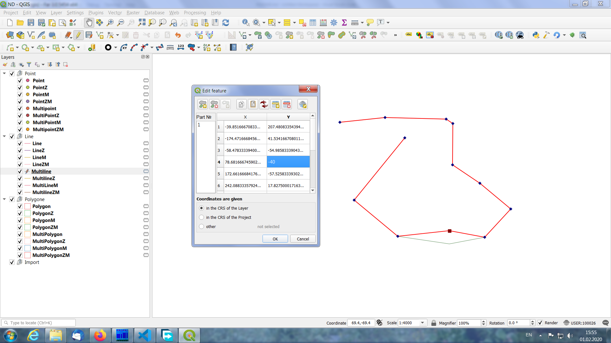

# Numerical Digitize 3

Plugin for QGIS for creating or editing features by adding or changing
coordinates of vertices.

## Installation

### Prerequisite

* QGIS version 3.4 or later

### Install via plugin repository in QGIS

1. In QGIS, navigate to menu **Plugins** > **Manage and Install Plugins...** >
**All**
2. Search for `Numerical Digitize 3` > **Install plugin**
3. Switch to tab **Installed**, make sure the plugin `Numerical Digitize 3` is
enabled.

### Install manually from zip file in QGIS

1. Download the [latest release](https://github.com/desertwolf7/numericalDigitize3/releases) zip file
2. In QGIS, navigate to menu **Plugins** > **Manage and Install Plugins...** >
**Install from ZIP**, then select the downloaded zip file.
3. Switch to tab **Installed**, make sure the plugin `Numerical Digitize 3` is
enabled.

## Usage

The extension for QGIS Numerical Digitize 3 is for adding or
edit objects such as a point, line, or polygon by entering or
change the coordinate values of their vertices.

This version of the extension is used for create or edit objects with one type
and consisting of points and lines. Working correctly with objects containing
curves, surfaces, or a collection of graphics primitives of various types are
not guaranteed.

The extension supports multi-part objects or contours and supports Z and M
coordinate values.

When you finish adding or editing an object, will done automatic translation of
coordinates into the coordinate system of the layer being edited.

In addition to editing the coordinates of the vertices, the extension
allows you to following:

1. Adding of object by entering coordinates of vertices from keyboard or from
clipboard.
2. Get the vertice's сoordinates of object and copy them to the clipboard.
3. Convert coordinate values from one projection to another.
4. Exchange coordinate values for X and Y.
5. Add or remove parts of objects and/or rings for polygons.
6. Add, edit, or delete coordinates of vertices.

In the main menu QGIS *Vector* will be added a new menu item *Numerical
digitize* coordinates with three submenu items *Numerical digitizing*,
*Numerical edit* and *Help*.

Read documentation for details of use.
