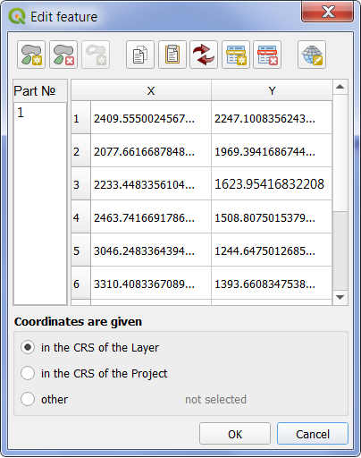

..  Numerical Digitize 3 documentation master file, created by
    sphinx-quickstart on Sat Jan 18 17:47:34 2020.
    You can adapt this file completely to your liking, but it should at least
    contain the root `toctree` directive.

Welcome to documentation for Numerical Digitize 3!
=========================================================

.. toctree::
   :maxdepth: 2

.. index::  General provisions

General provisions
================================================
The extension for QGIS Numeric Digitize 3 is for adding or
edit objects such as a point, line, or polygon by entering or
change the coordinate values of their vertices.

This version of the extension is used for create or edit objects with one type
and consisting of points and lines. Working correctly with objects containing
curves, surfaces, or a collection of graphics primitives of various types are
not guaranteed.

The extension supports multi-part objects or contours and supports Z and M
coordinate values.

When you finish adding or editing an object, will done automatic translation of
coordinates into the coordinate system of the layer being edited.

In addition to editing the coordinates of the vertices, the extension
allows you to following:

#. Paste a table of coordinate values from the clipboard or copy to the
   coordinates to clipboard for entered or existing coordinates.
#. Convert coordinate values from one projection to another.
#. Exchange coordinate values for X and Y.
#. Add or remove parts of objects and/or rings for polygons.
#. Add, edit, or delete vertices.

Description of plugin interface
===============================

.. |icon_add| image:: ../images/icon.svg
              :height: 24px
              :width: 24px
.. |icon_edit| image:: ../images/icon-edit.svg
              :height: 24px
              :width: 24px

.. |add_part| image:: ../images/mActionAddPart.svg
              :height: 24px
              :width: 24px
.. |delete_part| image:: ../images/mActionDeletePart.svg
                 :height: 24px
                 :width: 24px
.. |add_ring| image:: ../images/mActionAddRing.svg
              :height: 24px
              :width: 24px

.. |copy_coordinates| image:: ../images/mActionEditCopy.svg
              :height: 24px
              :width: 24px
.. |paste_coordinates| image:: ../images/mActionEditPaste.svg
              :height: 24px
              :width: 24px
.. |swap_coordinates| image:: ../images/swap.svg
              :height: 24px
              :width: 24px
.. |new_row| image:: ../images/mActionNewTableRow.svg
              :height: 24px
              :width: 24px
.. |delete_row| image:: ../images/mActionDeleteTableRow.svg
              :height: 24px
              :width: 24px
.. |reproject| image:: ../images/mActionSetProjection.svg
              :height: 24px
              :width: 24px

After installing the extension in the QGIS with standard way on the edit
toolbar two new icons will appear: |icon_add| and |icon_edit|. The first button
invokes the new object creation dialog, the second button starts the select
tool an existing object with a rectangular border. For the choice of an object
it is necessary to press the left mouse button and, holding it, draw a
rectangle, in that will be caught or that will be crossed by the object being
edited. In case no object or more then one will be selected, will be displayed
corresponding warning. When you select an object, the same window dialog,
as when creating a new object appears, and the coordinates will be loaded into
it table.

Also in the main menu QGIS *Vector* will be added a new menu item *Numerical
digitize* coordinates with three submenu items *Numerical digitizing*,
*Numerical edit* and *Help*.

Description of interface of main dialog
---------------------------------------

There are 3 panels with buttons at the top of the dialog box.

1. A panel for working with parts of an object or rings. It is displayed
during the work with objects that can consist of multiple parts or polygons.
For other object types panel is hidden.

|add_part| - add new part button for multipart objects. This is not active for
single part polygons.

|delete_part| - delete part or ring button for multipart objects or single part
polygons.

|add_ring| - Add ring button for polygon. The button is active only when
editing polygons.

2. The coordinate table rows panel contains the following buttons:

|copy_coordinates| - button to copy vertixe's coordinates to the clipboard.
Only the current part is copied. If no cells or only one cell are selected,
the entire table is copied. When two or more cells are selected (in the table,
cells are selected by a single rectangular block), only those cells are copied
to the clipboard.

|paste_coordinates| - button to copy point coordinates from the clipboard. If
a single row is selected, the coordinates from the buffer are inserted before
that row. If fewer than two cells are selected, the new coordinates are added
to the end of the table. When selecting two or more cells (in the table,
cells are selected by a single rectangular block) values from the buffer
are inserted only into these cells. Extra values in clipboard ignored, missing
- replaced by ``0``.

|swap_coordinates| - The button for exchanging values in columns X and Y.
Note that clicking the button exchanges values in all parts of the object, not
just the current one.

|new_row| - Insert new line button. Before pressing, select the entire row
before that will adding a new row. If no rows are selected, the new row is
will appended to the end of the table.

|delete_row| - Delete rows button. If no rows are selected, all rows will be
deleted after confirmation. If ont or several rows is selected, only this rows
will be deleted.

3. The Coordinate Conversion panel contains one button.

|reproject| - button to convert coordinates to another coordinate system.
Clicking displays two standard QGIS dialog boxes for selecting a coordinate
system. In the first, you must specify the source coordinate system (the
default is the current coordinate system) and then the target coordinate
system. After recalculation, the coordinate table is updated and the
destination coordinate system is set as the current coordinate system.

A list of object parts and a coordinate table are located in the center of the
dialog box.

The parts list contains integer numeric values. Positive values from 1 to N
denote object parts, negative values from -1 to -N denote polygon rings. To
add a part or ring, click |add_part| or |add_ring|, and then select the part
from the list to begin editing. To delete a part or ring, select the part or
ring to delete from the list and click |delete_part|.

The coordinate table contains 2 to 4 columns depending on the type of layer you
are editing. The table always contains columns X and Y, and can also contain
columns Z and/or M. To edit values, activate the desired cell and enter a
numeric value. The separator of the whole and fractional parts must correspond
to the regional settings. If the value entered is not a number, the cell
content color will be changed to red. You can switch from one cell to another
using the arrow keys, the TAB key, or the mouse. After filling in the last
line, if all the values of the line are numbers and the editable layer is not
a simple point, the new line is automatically added and will activate
the first cell of this row.

During editing, the current part is displayed as a red line in the map.
The node you are editing is displayed as a red square, and the remaining nodes
are displayed as blue diamonds.

In the lower part of the dialog box is situated Select Coordinate System panel,
where you can set coordinates reference system for entered values of vertices.
By default, the coordinate system of the layer you are editing is set.
The coordinates of vertices you add or edit can be in the project coordinate
system or an arbitrary coordinate system. Select the coordinate system by
selecting the desired button in the panel. Selecting an arbitrary coordinate
system displays the standard QGIS dialog box for selecting a coordinate system.

Examples of using this plugin
-----------------------------
1. Adding of object.
~~~~~~~~~~~~~~~~~~~~~~~~~~~~~~
To add a new object, make the desired layer editable and click |icon_add| and
enter the object's coordinates in the dialog box that appears. If necessary,
add a new part or ring, make it current, and enter the coordinates of the part.
When you are finished typing, click OK. If incorrect values have been entered,
a list of cells with incorrect values is displayed and you return to editing.

2. Add an object by entering coordinates from the clipboard
~~~~~~~~~~~~~~~~~~~~~~~~~~~~~~~~~~~~~~~~~~~~~~~~~~~~~~~~~~~
To add a new object, make the desired layer editable and click |icon_add|. In
any spreadsheet program, such as Microsoft Word, Microsoft Excel, LibreOffice
Writer, LibreOffice Calc, text recognition, or any other program, select the
point coordinates in the table and copy them to the clipboard. Then return to
the coordinate editing dialog and click |paste_coordinates|. If the object
consists of multiple parts, create new parts or rings, and then try the
operation again.

When adding an object, always pay attention to the coordinate system in which
the values you enter are located and, if it is not the coordinate system of the
layer you are editing, specify it in the coordinate selection panel. When the
object is added, the coordinates are automatically translated into the
coordinate system of the layer being edited.

3. Get the vertice's сoordinates of object and copy them to the clipboard
~~~~~~~~~~~~~~~~~~~~~~~~~~~~~~~~~~~~~~~~~~~~~~~~~~~~~~~~~~~~~~~~~~~~~~~~~
It is often necessary to insert object coordinates into a text or table 
document. To do this, make the layer in which the object resides editable.
Click |icon_edit| and select the desired object. In the coordinate dialog box,
click |copy_coordinates|. Navigate to the program in which you are editing the
document, create a table if necessary, and paste the vertices coordinates into
it. Repeat the operation for other parts of the object.

4. Editing object
~~~~~~~~~~~~~~~~~
To edit an object, make the desired layer editable and click |icon_edit| and
change the object coordinates in the dialog box that appears. During editing,
as well as adding, you can add or remove rows, add or remove parts and rings,
and swap X and Y columns.

5. Exchange X and Y column values
~~~~~~~~~~~~~~~~~~~~~~~~~~~~~~~~~
Sometimes, because of the coordinate system in QGIS, the X and Y axes are
swapped. When you type or paste from the clipboard and the X and Y columns are
swapped, you can correct the situation by clicking |swap_coordinates|. Note
that all parts of the object are exchanged. Therefore, if the coordinates
of one part have been incorrectly entered, the coordinates of the other parts
must be entered in the same way and only then exchanged.

6. Changing the Projection of node point coordinates
~~~~~~~~~~~~~~~~~~~~~~~~~~~~~~~~~~~~~~~~~~~~~~~~~~~~
If you added an object to an incorrect projection, you must begin editing the
object and specify the actual projection in the Projection Selector. When you
write an object, the coordinates are automatically translated into the
coordinate system of the layer you are editing.

7. Using the plugin as a Projection Calculator
~~~~~~~~~~~~~~~~~~~~~~~~~~~~~~~~~~~~~~~~~~~~~~~~~~~~
Sometimes it is necessary to specify a list of coordinates in a different
projection in a document. To do this, create a temporary layer, click
|icon_add|, copy the coordinate table from the program, paste the list of
coordinates from the clipboard, change the projection using |reproject|, and
copy the list of coordinates to the clipboard, and then paste the new table
into the program.

Indices and tables
==================

* :ref:`genindex`
* :ref:`modindex`
* :ref:`search`
