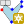
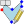
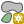
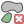
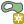
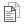
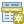
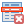
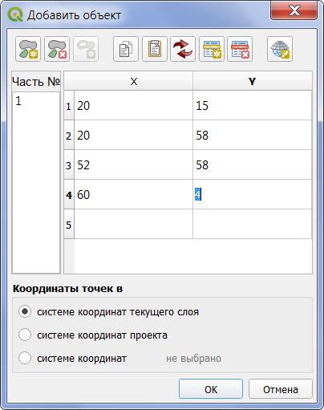

..  Numerical Digitize 3 documentation master file, created by
    sphinx-quickstart on Sat Jan 18 17:47:34 2020.
    You can adapt this file completely to your liking, but it should at least
    contain the root `toctree` directive.

Добро пожаловать в документацию по Numerical Digitize 3!
=========================================================

.. toctree::
   :maxdepth: 2

.. index::  Общие положения

Общие положения
================================================
Расширение для QGIS Numerical Digitize 3 предназначено для добавления или
редактирования объектов, таких как точка, линия или полигон, путем ввода или
изменения значений координат их узловых точек.

Данная версия расширения преднаначена для создания или редактирования объектов
одного типа, состоящих из точек и линий. Корректная работа с объектами,
содержащими в себе кривые, поверхности или являющимися коллекцией графических
примитивов различного типа, не гарантируется.

Расширение поддерживает работу с объектами, состоящими из нескольких частей или
контуров, а также использующих Z и M значения координат.

После окончания добавления или редактирования объекта производится
автоматический перевод координат в систему координат редактируемого слоя.

Кроме редактирования координат узловых точек расширение позволяет делать
следующее:

#. Вставлять из буфера обмена таблицу значений координат или копировать в буфер
   обмена введенные или существующие координаты.
#. Преобразовывать значения координат из одной проекции в другую.
#. Производить обмен значений координат для X и Y.
#. Добавлять или удалять части объектов и (или) кольца для полигонов.
#. Добавлять, изменять или удалять узловые точки.

Описание интерфейса расширения
===============================

.. |reproject| image:: ../images/mActionSetProjection.svg
              :height: 24px
              :width: 24px

После установки расширения стандартным для QGIS способом на панели инструментов
оцифровки появятся два новых значка: |icon_add| и |icon_edit|. Первый значёк
вызывает диалог создания нового объекта, второй значек запускает инструмент
выбора существующего объекта прямоугольной рамкой. Для выбора объекта
необходимо нажать левую кнопку мыши и, держа её, нарисовать прямоугольник, в
которую попадёт или которая пересечёт редактируемый объект. В случае, если
не будет выбран ни один объект или более одного объекта, будет отображено
соответствующее предупреждение. После выбора объекта появится окно такого же
диалога, как при создании нового объекта, и в него будут загружены координаты
объекта.

Также в основном меню QGIS *Вектор* будет добавлен новый пункт меню *Добавление
или редактирование объекта по координатам точек* с тремя пунктами подменю
*Добавление объектов по координатам точек*, *Координатное редактирование
объекта* и *Помощь*.

Описание интерфейса основного диалога
-------------------------------------

В верхней части окна диалога расположены 3 панели с кнопками.

1. Панель работы с частями объекта или кольцами. Отображается при работе
с объектами, которые могут состоять из нескольких частей или полигонами. Для
других типов объектов панель не отображается.

|add_part| - кнопка добавления новой части для объектов, которые могут состоять
из нескольких частей. Для простых полигонов не активна.

|delete_part| - кнопка удаления части для объектов, которые могут состоять
из нескольких частей, а также для удаления колец полигонов.

|add_ring| - кнопка добавления кольца для полигона. Кнопка активна
исключительно при редактировании полигонов.

2. Панель работы со строками таблицы координат содержит следующие кнопки:

|copy_coordinates|- кнопка копирования координат точек в буфер обмена.
Копируется только текущая часть. В случае, если выделено ни одной ячейки или
только одна ячейка, копируется вся таблица. При выделении двух и более ячеек
(в таблице организовано выделение ячеек одним прямоугольным блоком) в буфер
обмена копируются значения только этих ячеек.

|paste_coordinates| - кнопка копирования координат точек из буфера обмена. Если
выбрана целиком одна строка, то координаты из буфера вставлятся перед этой
строкой. Если выбрано менее двух ячеек, то новые координаты добавляются в конец
таблицы. При выделении двух и более ячеек (в таблице организовано выделение
ячеек одним прямоугольным блоком) значения из буфера вставлются только в эти
ячейки. Лишние значения в буфере обмена игнорируются, недостающие - заменяются
``0``.

|swap_coordinates| - кнопка обмена значений в столбцах X и Y. Внимание - при
нажатии кнопки происходит обмен значений во всех частях объекта, а не только
в текущей.

|new_row| - кнопка вставки новой строки. Перед нажатием необходимо выделить
целиком строку, перед которой будет добавлена новая строка. При отсутствии
выделенных строк новая строка будет добавлена в конец таблицы.

|delete_row| - кнопка удаления строк. В случае, если не выделена ни одна
строка, то после подтверждения будут удалены все строки. В случае, если
выделены несколько строк, то удалены будут только они.

3. Панель пересчета координат в другую систему координат содержит одну кнопку.

|reproject| - кнопка пересчета координат в другую систему координат. При
нажатии появятся два стандартных диалога QGIS выбора системы координат. В
первом необходимо указать исходную систему координат (по умолчанию
устанавливается текущая), а затем конечную систему координат. После перерасчета
таблица координат будет обновлена, а в качестве текущей системы координат будет
уставновлена выбранная.

В центре окна диалога расположены список частей объекта и таблица координат.

Список частей объекта содержит целые числовые значения. Положительные значения
от 1 до N обозначают части объекта, отрицательные значения от -1 до -N
обозначают кольца полигонов. Для добавления части или кольца нажмите кнопку
|add_part| или |add_ring|, после чего для начала редактирования выберите нужную
часть из списка. Для удаления части или кольца выберети в списке удаляемую
часть или кольцо и нажмите кнопку |delete_part|.

Таблица координат содержит от 2 до 4 столбцов в зависимости от типа
редактируемого слоя. Таблица всегда содержит столбцы X и Y, а также может
содержать столбцы Z и(или) M. Для редактирования значений активируйте нужную
ячейку и введите числовое значение. Разделитель целой и дробной частей должен
соответствовать региональным настройкам. В случае, если введенное значение не
является числом, цвет содержимого ячейки будет изменен на красный. Переход из
одной ячейки в другую может осуществляться клавишами стрелками, клавишей TAB
или с помощью мыши. После заполнения последний строки, в случае если все
значения строки являются числами и редактируемый слой не является простым
точечным, автоматически добавляется новая строки и осуществляется переход на
первую ячейку этой строки.

В процессе редактирования текущая часть отображается на карте в виде красной
линии. Редактируемый узел отображается в виде красного квадрата, остальные
узлы - в виде синих ромбов.

В нижней части окна диалога панель выбора системы координат, в которой
производится ввод значений узловых точек. По умолчанию установлена система
координат редактируемого слоя. Координаты добавляемых или редактируемых
точек могут быть в системе координат проекта или произвольной системе
координат. Выбор системы координат производится путем выбора нужной кнопки
в панели. При выборе произвольной системы координат будет отображен стандартный
диалог QGIS выбора системы координат.

Примеры использования этого расширения
--------------------------------------
1. Простое добавление объекта.
~~~~~~~~~~~~~~~~~~~~~~~~~~~~~~
Для добавления нового объекта сделайте нужный слой редактируемым и нажмите
кнопку |icon_add| и в появившемся окне диалога введите координаты объекта. При
необходимости добавте новую часть или кольцо, сделайте её текущей и так же
введите координаты части объекта. По окончании ввода нажмите кнопку ОК. В
случае, если были введены неправильные значения, будет отображен список ячеек
с неправильными значениями и произведен возврат к редактированию.

2. Добавление объекта путем ввода координат из буфера обмена
~~~~~~~~~~~~~~~~~~~~~~~~~~~~~~~~~~~~~~~~~~~~~~~~~~~~~~~~~~~~
Для добавления нового объекта сделайте нужной слой редактируемым и нажмите
кнопку |icon_add|. В любой программе для работы с таблицами, такими как
Microsoft Word, Microsoft Excel, LibreOffice Writer,  LibreOffice Calc,
программе распознавания текста или любой другой программе выделите в таблице
значения, явлющиеся координатами точек, и скопируйте их в буфер обмена. Затем
вернитесь в диалог редактирования координат и нажмите кнопку
|paste_coordinates|. В случае, если объект состоит из нескольких частей,
создайте новые части или кольца и повторите операцию.

При добавлении объекта всегда обращайте внимание на то, в какой системе
координат находятся вводимые значения и в случае, если это не система координат
редактируемого слоя, указывайте её в панели выбора координат.
После окончания добавления объекта производится автоматический перевод
координат в систему координат редактируемого слоя.

3. Извлечение координат узловых точек объекта и копирование их в буфер обмена
~~~~~~~~~~~~~~~~~~~~~~~~~~~~~~~~~~~~~~~~~~~~~~~~~~~~~~~~~~~~~~~~~~~~~~~~~~~~~
Достаточно часто возникает необходимость вставить координаты объекта в
какой-либо документ. Чтобы сделать это, сделайте слой, в котором находится
объект, редактируемым. Нажмите кнопку |icon_edit| и выберите нужный объект. В
появившемся диалоге с координатами нажмите кнопку |copy_coordinates|. Перейдите
в программу, в которой редактируется документ, создайте таблицу при
необходимости, и вставьте в нее координаты точек. Повторите операцию для других
частей объекта.

4. Редактирование объекта
~~~~~~~~~~~~~~~~~~~~~~~~~
Для редактирования объекта сделайте нужной слой редактируемым и нажмите
кнопку |icon_edit| и в появившемся окне диалога измените координаты
объекта. В процессе редактирования, так же как и при добавлении, возможно
добавлять или удалять строки, добавлять или удалять части и кольца, менять
местами столбы X и Y.

5. Обмен значений столбцов X и Y
~~~~~~~~~~~~~~~~~~~~~~~~~~~~~~~~
Иногда из-за особенностей системы координат в QGIS поменяны местами оси X и Y.
В случаях, когда при вводе или вставке из буфера обмена столбцы X и Y
оказываются поменяны местами, возможно исправить ситуацию нажав кнопку
|swap_coordinates| При этом необходимо учитывать, что обмен производится по
всем частям объекта. Поэтому в случае, если были неправильно внесены координаты
одной части, необходимо внести таким же образом координаты других частей, и
лишь затем произвести обмен.

6. Изменение проекции координат узловых точек
~~~~~~~~~~~~~~~~~~~~~~~~~~~~~~~~~~~~~~~~~~~~~
В случае, если объект был добавлен в неправильной проекции, необходимо начать
редактирование объекта и указать реальную проекцию в панели выбора проекции.
При записи объекта будет производен автоматический перевод координат в систему
координат редактируемого слоя.

7. Использование расширения как калькулятор проекций
~~~~~~~~~~~~~~~~~~~~~~~~~~~~~~~~~~~~~~~~~~~~~~~~~~~~
Иногда бывает необходимо в каком-либо документе указать перечень координат в
другой проекции. Для этого создайте временный слой, нажмите кнопку |icon_add|,
скопируйте из программы таблицу координат, вставьте из буфера обмена перечень
координат, измените проекцию с помощью кнопки |reproject| и скопируйте перечень
координат в буфер обмена, после чего вставьте новую таблицу в программу.

Индексы и таблицы
==================

* :ref:`genindex`
* :ref:`modindex`
* :ref:`search`
